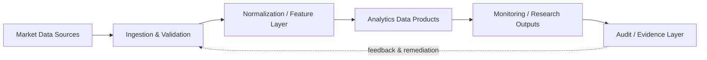
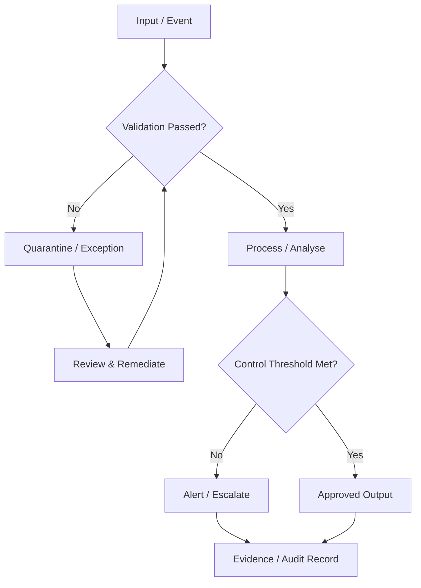

# Process & Control Flows

## End-to-end operating flow

## Control lifecycle

## Engineering expectations

- Inputs remain traceable to source.
- Validation occurs before downstream processing.
- Exceptions are explicit states rather than silent failures.
- Material actions produce evidence suitable for review.
- Metrics are derived from the same governed state used by operational workflows.
- Production deployment requires environment-specific identity, authorization, secrets management and observability.
